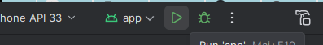

# Ionic_Keycloak_impl
Implementation of Keycloak in an Ionic-Angular project for IOS &amp; Android

# Create an app with Angular-Ionic and Capacitor (To build on plateforms)
    - ionic start keycloak-login tabs --type=angular --capacitor
## Use standalone (The Angular team recommends using standalone components for all new development)

# To build
    - build:capacitor
    - build:android
    -  Click on green button for Android

### Task delivered, but as I'm an honest developper, there may be a better a better way to handle Keycloak for Angular https://github.com/mauriciovigolo/keycloak-angular with silentCheckSsoRedirectUri property